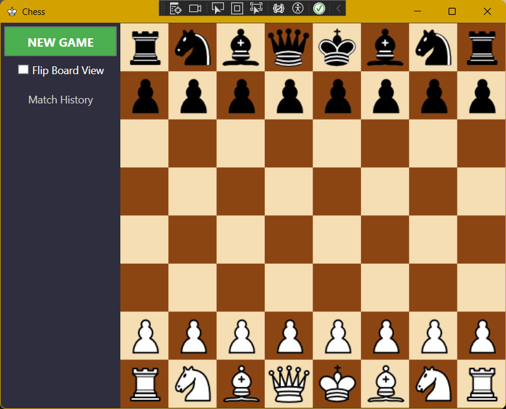
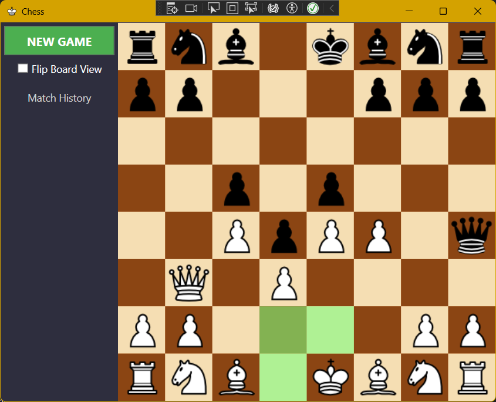
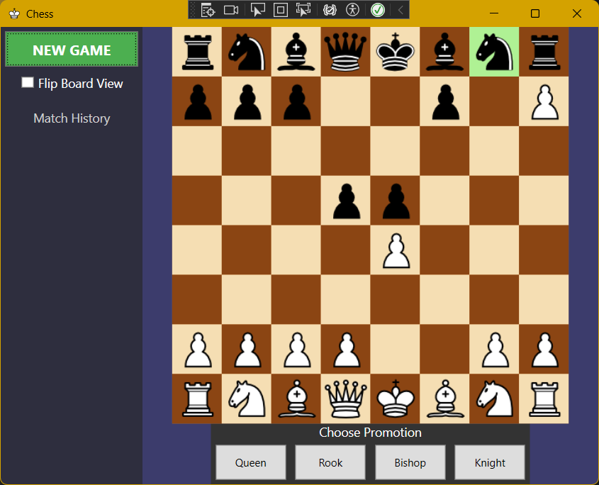
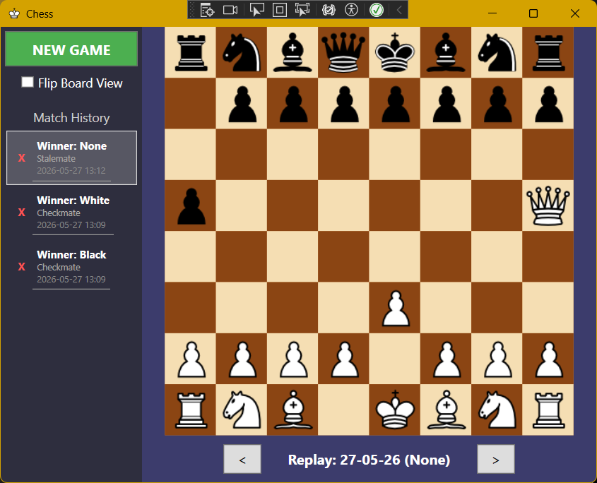

# ♟️ Chess — Cross-Platform Desktop Chess Application in C# / Avalonia UI

A fully functional two-player chess desktop application built with **C#** and **Avalonia UI (.NET)**, implementing the complete official FIDE ruleset, running natively on both **Windows** and **Linux**. The project is structured into two clean layers: a standalone chess engine (`Chess.Core`) and an Avalonia graphical front-end (`Chess.Avalonia`).

---

## 📸 Screenshots

<!-- PLACEHOLDER: Add a screenshot of the main window here -->
> 
> *Main application window — chessboard with side panel*

<!-- PLACEHOLDER: Add a screenshot of a check/endgame state -->
> 
> *Check detection and move highlighting*

<!-- PLACEHOLDER: Add a screenshot of the pawn promotion dialog -->
> 
> *Pawn promotion dialog*

<!-- PLACEHOLDER: Add a screenshot of the game history panel -->
> 
> *History and replay mode support*

---

## ✨ Features

### Core Game Logic
- ✅ Full legal move validation for all 6 piece types (Pawn, Rook, Knight, Bishop, Queen, King)
- ✅ Check and checkmate detection via **move simulation**
- ✅ Stalemate detection
- ✅ **Castling** — both kingside and queenside
- ✅ **En Passant** capture
- ✅ **Pawn Promotion** — with a UI dialog for piece selection

### Draw Conditions
- ✅ Stalemate

### UI & UX
- ✅ Interactive Avalonia board — click to select and move pieces
- ✅ Board flip (swap White/Black perspective)
- ✅ Pawn promotion dialog
- ✅ Game-over screen with result display
- ✅ Side panel with match history

### Data Persistence
- ✅ Game history saved to a local **JSON file** (`game_history.json`) using `Newtonsoft.Json`
- ✅ Move replay — review any past game move by move
- ✅ Graceful I/O error handling (corrupted file recovery, auto-creation on first run)

---

## 🏗️ Architecture

The solution is split into two projects, enforcing separation of concerns:

```
Chess/
├── Chess.Core/         # Chess engine — pure game logic, no UI dependencies
│   ├── Game.cs         # Main game controller (turn management, end-condition checks)
│   ├── Board.cs        # 8×8 board representation, piece placement, IsInCheck
│   ├── Piece.cs        # Abstract base class with GetValidMoves, MoveInDirections, MoveToPositions
│   ├── Move.cs         # Base move class with Execute() and Undo()
│   ├── Position.cs     # Board coordinate struct with equality overrides
│   ├── CastlingMove.cs # Moves king + rook simultaneously; full Undo support
│   ├── EnPassantMove.cs# Removes captured pawn from the skipped square
│   ├── PromotionMove.cs# Replaces pawn with chosen piece on Execute
│   ├── HistoryManager.cs  # Static class: JSON serialization / deserialization
│   ├── GameRecord.cs   # DTO: date, winner, end reason, move list
│   ├── MoveRecord.cs   # DTO: From / To coordinates for history storage
│   └── Enums/          # Player, PieceType, EndReason
│
└── Chess.Avalonia/     # Avalonia UI front-end (Windows + Linux)
    ├── MainWindow.axaml / .cs  # Board rendering, pointer events, side panel, dialogs
    └── Images/Images.cs       # Static class: loads piece images into Avalonia Bitmap objects
```

### Key Design Decisions

**Move simulation for check detection** — instead of maintaining a separate attack map, every candidate move is executed on the real board, `IsInCheck` is queried, and then `Undo()` restores the original state. This keeps the logic simple and provably correct.

**C# generators for move generation** — `GetValidMoves` uses `yield return` (lazy `IEnumerable<Move>`), so the engine only computes moves as they're needed. This reduces memory usage and allows early-exit when, for example, searching for any move that escapes check.

**Strict separation of Core and UI** — `Chess.Core` has zero UI-framework dependencies and can be tested or reused independently (e.g. for a future AI or web front-end).

---

## 🚀 Getting Started

### Prerequisites
- **Windows** or **Linux**
- [**.NET SDK**](https://dotnet.microsoft.com/download) matching the version targeted by `Chess.Avalonia.csproj`

### Run from Source

```bash
git clone https://github.com/Feitasss/Chess.git
cd Chess
dotnet run --project Chess.Avalonia/Chess.Avalonia.csproj
```

Alternatively, open `Chess.sln` in your IDE of choice (Visual Studio, Rider, VS Code), set `Chess.Avalonia` as the startup project, and run.

### Publishing a standalone binary

```bash
dotnet publish Chess.Avalonia/Chess.Avalonia.csproj -c Release -r linux-x64 --self-contained true -p:PublishSingleFile=true
```

Swap `linux-x64` for `win-x64` to target Windows. Output lands in `Chess.Avalonia/bin/Release/<tfm>/<rid>/publish/`.

### System Requirements

| Component       | Minimum                              |
|-----------------|--------------------------------------|
| OS              | Windows 10+ or a modern Linux distro |
| CPU             | 1 GHz                                |
| RAM             | 512 MB                               |
| Disk            | ~50 MB                               |
| Display         | 800 × 600 px                         |

---

## 🛠️ Tech Stack

| Layer       | Technology                         |
|-------------|-------------------------------------|
| Language    | C# (.NET)                          |
| UI          | Avalonia UI + AXAML                |
| Persistence | Newtonsoft.Json (JSON file)        |
| Build       | dotnet CLI / Visual Studio / Rider |
| VCS         | Git / GitHub                       |

---

## 🗺️ Roadmap

- [ ] More Draw conditions
- [ ] AI opponent (minimax / alpha-beta pruning)
- [ ] Game clock / time controls
- [ ] PGN import / export
- [ ] Online multiplayer
- [ ] Other gamemodes (Chess 960 etc)

---

## 👤 Author

**[Feitasss](https://github.com/Feitasss)**  
Computer Science student — UITM in Rzeszów  
Skills: C#, Python, Avalonia UI, .NET, SQL, Git

---

## 📄 License

This project is open source. Feel free to fork and build on it.
